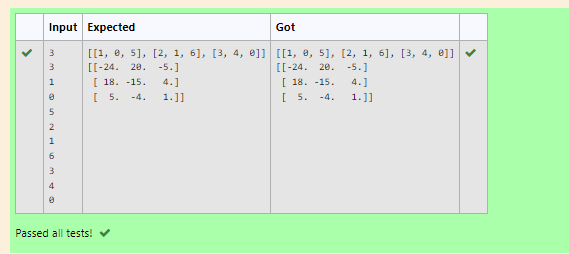

# Inverse-of-matrix

## AIM:
write a python programming to find inverse of matrix.
## ALGORITHM:
### Step 1:
Import numpy module.
### Step 2:
Declare a variables l1 and l2 as ana empty list.
### Step 3:
Get the input of the variables n and m.
### Step 4:
Loop a variable i in the range of n and nest loop a variable in range m. 
### Step 5:
Get the value of num variable.
### Step 6:
During the loop append the num values to l1 and l1 value to list l2.
### Step 7:
Declare a variable value l1 to l2 by converting to an array.
### Step 8:
Declare a variable inverse using numpy modules linalg and inv functions find the inverse of l2.
### Step 9:
Print the value of the inverse.
## PROGRAM:
```
import numpy as np
no_of_col,no_of_row=int(input()),int(input())
l1,l2=[],[]
for i in range(no_of_row):
    for j in range(no_of_col):
        l1.append(int(input()))
    l2.append(l1)
    l1=[]
print(l2)
value1=np.array(l2)
inverse = np.linalg.inv(value1)
print(inverse)
```
## OUTPUT:

## RESULT:
